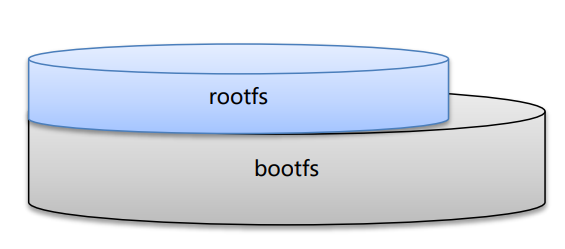
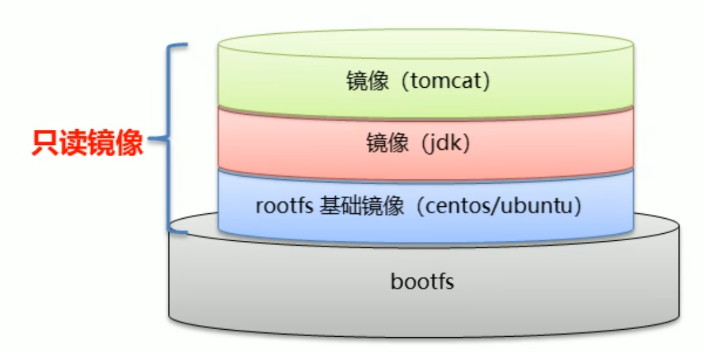
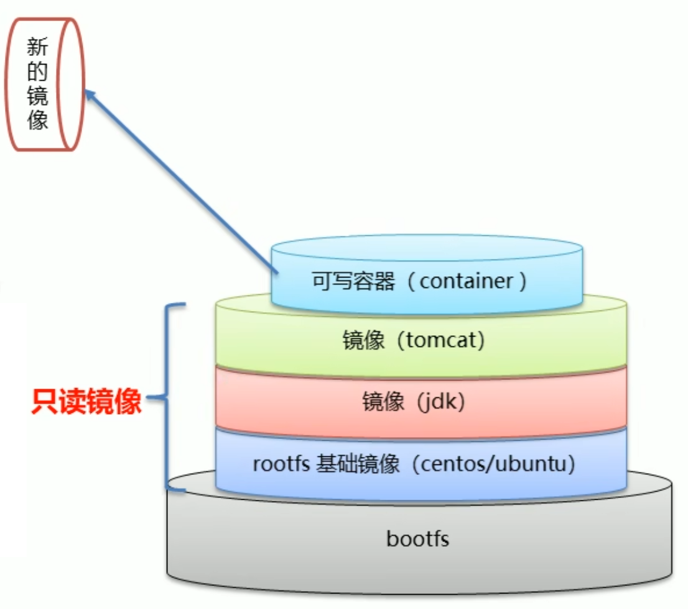
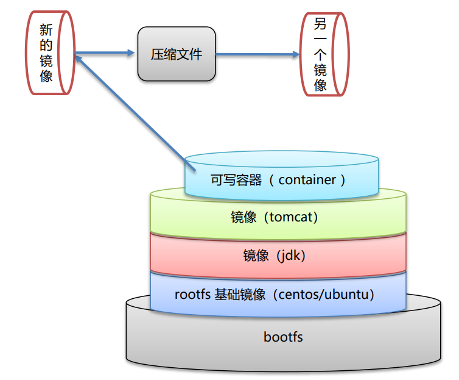

# Dockerfile

## Linux File System Structure

Linux 文件系统由 **bootfs** 和 **rootfs** 两部分组成。

| 组成部分 | 内容                            | 各发行版差异 |
| -------- | ------------------------------- | ------------ |
| bootfs   | bootloader + kernel             | 基本相同     |
| rootfs   | /dev /proc /bin /etc 等标准目录 | 各不相同     |

---

### bootfs (Boot File System)

- 包含 **bootloader**（引导加载程序）和 **kernel**（内核）
- 负责系统启动阶段的引导工作
- 不同的 Linux 发行版，bootfs 基本一样

---

### rootfs (Root File System)

- root 文件系统
- 包含典型 Linux 系统中的标准目录和文件：
  - `/dev` — 设备文件
  - `/proc` — 进程信息
  - `/bin` — 基本命令
  - `/etc` — 配置文件
- 不同的 Linux 发行版，rootfs 不同（如 Ubuntu、CentOS 等）

---

### 

---

## Docker 镜像原理

### 镜像分层结构

Docker 镜像是由特殊的文件系统**叠加**而成，从下到上依次x为：



---

### 核心要点

- **最底层是 bootfs**，直接使用宿主机的 bootfs（内核共享）
- **第二层是 rootfs**，称为 Base Image（如 CentOS / Ubuntu）
- **往上可以继续叠加**其他镜像文件（如 JDK、Tomcat）
- **除最顶层容器外，所有镜像层均为只读**（联合文件系统）

---

### Union File System（联合文件系统）

- 能够将不同的层**整合成一个统一的文件系统**
- 对用户隐藏了多层的存在，用户视角只看到一个文件系统
- 是 Docker 镜像分层技术的核心支撑

---

### 父镜像 & 基础镜像

| 概念 | 说明 |
|------|------|
| 基础镜像（Base Image） | 最底部的镜像，即 rootfs 层（CentOS / Ubuntu） |
| 父镜像（Parent Image） | 位于某镜像下面的镜像 |
| 容器读写层 | 启动容器时，Docker 在最顶层加载一个**读写文件系统** |

---

### 新镜像的生成

当对运行中的容器做出修改并提交（`docker commit`），
Docker 会将**可写层固化为新的只读镜像层**，叠加在原有镜像之上，
从而形成一个新的镜像。

```
原镜像层（只读） + 修改内容（提交） = 新镜像
```

---

## 为什么 Docker 镜像体积较大？

### 以 Tomcat 为例

直接下载 Tomcat 安装包只有约 **70 MB**，
但通过 Docker 拉取的 Tomcat 镜像却有约 **500 MB**。

原因：Docker 镜像并不只是 Tomcat 本身，而是**包含了运行它所需的完整分层环境**：

```
┌─────────────────────────────┐
│         Tomcat (~70MB)       │  ← 应用层
├─────────────────────────────┤
│           JDK (~200MB)       │  ← 运行时依赖层
├─────────────────────────────┤
│    Base Image: CentOS (~200MB)│  ← rootfs 基础层
├─────────────────────────────┤
│          bootfs              │  ← 使用宿主机内核，不占镜像空间
└─────────────────────────────┘
         合计 ≈ 470MB+
```

> **结论**：镜像体积大，是因为它打包了完整的运行环境（OS + 运行时 + 应用），
> 而不是只有应用本身。这正是 Docker **"一次构建，到处运行"** 的代价。

---

## 镜像层复用（分层的核心优势）

你的理解完全正确 ✅

**底层镜像（只读层）可以被多个镜像共享复用。**

### 复用原理

```
          镜像 A (Tomcat)          镜像 B (Nginx)
         ┌────────────────┐       ┌───────────────┐
         │  Tomcat 层     │       │  Nginx 层     │
         ├────────────────┤       ├───────────────┤
         │  JDK 层        │       │               │
         ├────────────────┤       │               │
         └───────┬────────┘       └───────┬───────┘
                 │                        │
                 └──────────┬─────────────┘
                            ↓
                 ┌──────────────────┐
                 │  CentOS 基础镜像  │  ← 共享同一层，磁盘只存一份
                 └──────────────────┘
```

### 复用的好处

| 场景 | 效果 |
|------|------|
| 本机已有 CentOS 基础层 | 拉取 Tomcat 镜像时，CentOS 层**无需重复下载** |
| 多个容器使用同一镜像 | 只读层在磁盘上**只保存一份**，节省存储 |
| 构建新镜像 | 可以直接复用已有层，**只构建差异部分** |

> **只读层 = 可以安全共享**，因为没有任何人能修改它；
> 每个容器只有自己独立的**可写层**，互不干扰。


## 修改容器内容 → 生成新镜像



---

### 流程说明

当你启动一个 Tomcat 容器并对其进行修改时，Docker 的处理机制如下：

**第一步：启动容器**，Docker 在镜像所有只读层的最顶部，自动加载一个**可读写层（Container Layer）**：

```
┌──────────────────────────────┐
│  可读写层（Container Layer）  │  ← 你的所有修改都写在这里
├──────────────────────────────┤
│       Tomcat 层（只读）        │  ↑
├──────────────────────────────┤  │
│        JDK 层（只读）          │  │ 原始镜像层，不会被修改
├──────────────────────────────┤  │
│     CentOS 基础层（只读）      │  ↓
└──────────────────────────────┘
```

**第二步：在容器中修改文件**（如修改 Tomcat 配置、部署 war 包等），所有改动只写入**可读写层**，原始的只读层**完全不受影响**。

**第三步：提交为新镜像**（`docker commit`），Docker 将可读写层**固化为一个新的只读层**，叠加在原镜像之上：

```
┌──────────────────────────────┐
│   新增层（你的修改，只读）     │  ← commit 后固化为新层
├──────────────────────────────┤
│       Tomcat 层（只读）        │
├──────────────────────────────┤
│        JDK 层（只读）          │
├──────────────────────────────┤
│     CentOS 基础层（只读）      │
└──────────────────────────────┘
         = 新的 Tomcat 镜像（my-tomcat）
```

### 核心命令

```bash
# 1. 启动容器
docker run -it tomcat /bin/bash

# 2. 在容器内做修改（例如部署应用）
cp myapp.war /usr/local/tomcat/webapps/

# 3. 退出并提交为新镜像
docker commit <容器ID> my-tomcat:v1.0
```

### 关键规则总结

| 规则 | 说明 |
|------|------|
| 只读层不可修改 | 镜像的每一层在构建后永远是只读的 |
| 修改写入可读写层 | 容器运行期间所有改动仅存在于顶层可读写层 |
| commit 固化修改 | `docker commit` 将可读写层变为新的只读层 |
| 原镜像不受影响 | 新镜像是在原镜像基础上叠加，原镜像本身不变 |
| 容器删除则丢失 | 若不 commit，容器删除后可读写层的修改**永久丢失** |


## Docker 镜像制作

Docker 镜像有两种制作方式：

| 方式 | 说明 | 适用场景 |
|------|------|----------|
| **方式一：容器转镜像** | 在运行中的容器里做修改，再 `docker commit` 打包 | 快速调试、临时定制 |
| **方式二：Dockerfile** | 编写构建脚本，用 `docker build` 自动构建 | 生产环境、版本管理 ✅ 推荐 |

---

## 方式一：容器转镜像



### 完整流程

```
原始镜像（如 tomcat）
       ↓  docker run
   运行中的容器
       ↓  在容器内做修改（安装软件、部署应用等）
       ↓  docker commit
   新的镜像（压缩包形式）
       ↓  docker save（可选：导出为 .tar 文件）
   镜像文件（.tar）
       ↓  docker load（在其他机器上导入）
   其他机器上的镜像
```

### 核心命令

```bash
# 1. 基于现有镜像启动容器
docker run -it --name mycontainer tomcat /bin/bash

# 2. 在容器内做修改（如部署 war 包）
cp myapp.war /usr/local/tomcat/webapps/

# 3. 退出容器
exit

# 4. 将容器提交为新镜像
docker commit mycontainer my-tomcat:1.0

# 5. 查看新镜像
docker images
```

### 导出 & 导入（迁移到其他机器）

```bash
# 导出镜像为 .tar 文件
docker save -o my-tomcat.tar my-tomcat:1.0

# 在其他机器上导入
docker load -i my-tomcat.tar
```

### ⚠️ 注意事项

- **挂载目录不会被打包**：容器启动时用 `-v` 挂载的目录，`docker commit` **不会**将其内容打包进镜像
- 适合临时使用，不适合生产环境（无法追溯构建过程）

---

## 方式二：Dockerfile（推荐）

### 什么是 Dockerfile？

Dockerfile 是一个**文本脚本文件**，包含一系列指令，
Docker 按顺序执行这些指令，**自动构建镜像**。

```
Dockerfile（构建脚本）
       ↓  docker build
   自动化构建镜像
       ↓  docker run
   运行容器
```

### Dockerfile 示例

```dockerfile
# 基础镜像
FROM centos:7

# 维护者信息
MAINTAINER myname <myname@example.com>

# 安装 JDK
ADD jdk-8u171-linux-x64.tar.gz /usr/local/

# 安装 Tomcat
ADD apache-tomcat-8.5.46.tar.gz /usr/local/

# 设置环境变量
ENV JAVA_HOME /usr/local/jdk1.8.0_171
ENV PATH $JAVA_HOME/bin:$PATH

# 暴露端口
EXPOSE 8080

# 启动 Tomcat
CMD ["/usr/local/apache-tomcat-8.5.46/bin/catalina.sh", "run"]
```

### 构建命令

```bash
# 在 Dockerfile 所在目录执行
docker build -f Dockerfile -t my-tomcat:1.0 .

# 查看构建好的镜像
docker images
```

### 两种方式对比

| 对比项 | 容器转镜像（commit） | Dockerfile（build） |
|--------|---------------------|---------------------|
| 构建过程 | 手动操作 | 脚本自动化 |
| 可重复性 | ❌ 难以复现 | ✅ 完全可复现 |
| 版本管理 | ❌ 无法追踪变更 | ✅ 可 Git 管理 |
| 镜像大小 | 较大（含操作历史） | 可优化控制 |
| 推荐程度 | 调试/临时使用 | ✅ 生产环境首选 |

---

## Dockerfile 案例：自定义 CentOS7 镜像

### 需求

基于 `centos:7` 制作自定义镜像，要求：
1. 默认登录路径为 `/usr`
2. 容器内可以使用 `vim` 编辑器

### 实现步骤

| 步骤 | 指令 | 说明 |
|------|------|------|
| ① | `FROM centos:7` | 定义父镜像 |
| ② | `MAINTAINER itheima <itheima@itcast.cn>` | 定义作者信息 |
| ③ | `RUN yum install -y vim` | 执行安装 vim 命令 |
| ④ | `WORKDIR /usr` | 定义默认工作目录 |
| ⑤ | `CMD /bin/bash` | 定义容器启动时执行的命令 |
| ⑥ | `docker build` | 通过 Dockerfile 构建镜像 |

### Dockerfile 文件内容

```dockerfile
FROM centos:7
MAINTAINER itheima <itheima@itcast.cn>
RUN yum install -y vim
WORKDIR /usr
CMD /bin/bash
```

### 构建镜像命令

```bash
# -f 指定 Dockerfile 文件路径
# -t 指定镜像名称和版本
# 末尾的 . 表示构建上下文为当前目录
docker build -f ./dockerfile -t my-centos:1.0 .
```

### 验证结果

```bash
# 运行自定义镜像
docker run -it my-centos:1.0

# 进入容器后，默认路径应为 /usr
pwd
# 输出：/usr

# 验证 vim 可用
vim --version
```

### 构建过程说明

```
docker build 执行流程：

Step 1/5 : FROM centos:7          ← 拉取基础镜像
Step 2/5 : MAINTAINER itheima...  ← 写入作者信息
Step 3/5 : RUN yum install -y vim ← 在临时容器中安装 vim，完成后固化为新层
Step 4/5 : WORKDIR /usr           ← 设置工作目录
Step 5/5 : CMD /bin/bash          ← 设置启动命令

Successfully built xxxxxxxxxx
Successfully tagged my-centos:1.0
```

> 每一条指令都会生成一个新的镜像层，最终叠加成完整镜像。

---

## Dockerfile 案例：发布 Spring Boot 项目

### 需求

将一个打包好的 Spring Boot 项目（`springboot.jar`）制作成 Docker 镜像，并运行为容器。

### 实现步骤

| 步骤 | 指令 | 说明 |
|------|------|------|
| ① | `FROM java:8` | 以 JDK 8 镜像为父镜像 |
| ② | `MAINTAINER itheima <itheima@itcast.cn>` | 定义作者信息 |
| ③ | `ADD springboot.jar app.jar` | 将本地 jar 包复制到容器内，重命名为 `app.jar` |
| ④ | `CMD java -jar app.jar` | 容器启动时执行该命令运行项目 |
| ⑤ | `docker build` | 通过 Dockerfile 构建镜像 |

### Dockerfile 文件内容

```dockerfile
FROM java:8
MAINTAINER itheima <itheima@itcast.cn>
ADD springboot.jar app.jar
CMD java -jar app.jar
```

### 项目目录结构

```
my-springboot/
├── Dockerfile
└── springboot.jar       ← 打包好的 Spring Boot jar 包
```

### 构建 & 运行命令

```bash
# 1. 构建镜像（在 Dockerfile 所在目录执行）
docker build -f ./Dockerfile -t springboot-app:1.0 .

# 2. 运行容器（映射端口 8080）
docker run -d -p 8080:8080 springboot-app:1.0

# 3. 查看运行状态
docker ps

# 4. 访问项目
# 浏览器打开：http://localhost:8080
```

### 构建过程说明

```
Step 1/4 : FROM java:8                         ← 拉取 JDK8 基础镜像
Step 2/4 : MAINTAINER itheima...               ← 写入作者信息
Step 3/4 : ADD springboot.jar app.jar          ← 将 jar 包复制进镜像
Step 4/4 : CMD java -jar app.jar               ← 设置启动命令

Successfully built xxxxxxxxxx
Successfully tagged springboot-app:1.0
```

### ADD vs COPY 区别

| 指令 | 说明 |
|------|------|
| `COPY springboot.jar app.jar` | 单纯复制文件，推荐用于普通文件 |
| `ADD springboot.jar app.jar` | 复制文件，额外支持自动解压 `.tar` 压缩包 |

> 普通 jar 包两者效果相同；若源文件是压缩包且需要自动解压，才用 `ADD`。

---

## Docker + GitHub：一次编写，到处运行

### 核心思想

把 `Dockerfile` 和代码一起上传到 GitHub，
任何人克隆项目后，只需要一条命令就能运行，**无需手动安装环境**。

```
开发者（你）                    其他人 / 服务器
─────────────────               ──────────────────────────
1. 写代码                       1. git clone 你的仓库
2. mvn package → springboot.jar 2. docker build ...
3. 写 Dockerfile                3. docker run ...
4. git push 到 GitHub     →→→   4. 项目直接跑起来 ✅
```

### GitHub 仓库结构

```
my-springboot/
├── src/                    ← 源代码
├── pom.xml
├── springboot.jar          ← 打包好的 jar（或 CI 自动构建）
├── Dockerfile              ← 镜像构建脚本
└── README.md               ← 说明如何运行
```

### 别人拿到项目后，只需两步

```bash
# 第一步：克隆项目
git clone https://github.com/yourname/my-springboot.git
cd my-springboot

# 第二步：构建并运行
docker build -t springboot-app:1.0 .
docker run -d -p 8080:8080 springboot-app:1.0

# 完成！访问 http://localhost:8080
```

> 不需要安装 JDK，不需要配置环境变量，不需要手动部署。
> **只要对方装了 Docker，就能运行你的项目。**

### 为什么这很重要？

| 传统部署 | Docker 部署 |
|----------|-------------|
| "在我电脑上能跑" 问题频发 | 环境打包进镜像，到处一致 |
| 需要手动安装 JDK、Tomcat 等 | 只需安装 Docker |
| 新服务器需重新配置环境 | `docker run` 一条命令搞定 |
| 多人协作环境不一致 | 所有人用同一个镜像，完全一致 |

---

## 实战：部署到 AWS EC2

### 传统部署 vs Docker 部署

**传统方式**（每台新服务器都要重复这些步骤）：
```bash
# 要手动做一大堆事情...
sudo yum install java-1.8.0-openjdk      # 安装 JDK
sudo yum install tomcat                   # 安装 Tomcat
# 配置环境变量...
# 上传 jar 包...
# 修改配置文件...
# 设置开机自启...
# 出了问题还不知道哪步错了
```

**Docker 方式**（任何新 EC2，永远只需这几步）：
```bash
# 1. 安装 Docker（只需一次）
sudo yum install -y docker
sudo systemctl start docker

# 2. 克隆项目
git clone https://github.com/yourname/my-springboot.git
cd my-springboot

# 3. 构建并运行
docker build -t springboot-app:1.0 .
docker run -d -p 8080:8080 springboot-app:1.0

# 完成 ✅ 开了个新 EC2？重复第 2、3 步就行
```

### 更进一步：直接拉 Docker Hub 镜像

如果把镜像提前推送到 Docker Hub，EC2 上**连 `git clone` 都不需要**：

```bash
# 开发机：构建完推送到 Docker Hub
docker build -t yourname/springboot-app:1.0 .
docker push yourname/springboot-app:1.0

# EC2 上：直接拉取运行，一条命令搞定
docker pull yourname/springboot-app:1.0
docker run -d -p 8080:8080 yourname/springboot-app:1.0
```

```
开发机  ──push──▶  Docker Hub  ──pull──▶  EC2 / 任意服务器
                               ──pull──▶  EC2 #2
                               ──pull──▶  EC2 #3
```

> 扩容再多台服务器，每台都只需要 `docker pull` + `docker run`，
> **完全不需要重复配置环境**，这就是 Docker 在云部署上最大的价值。


